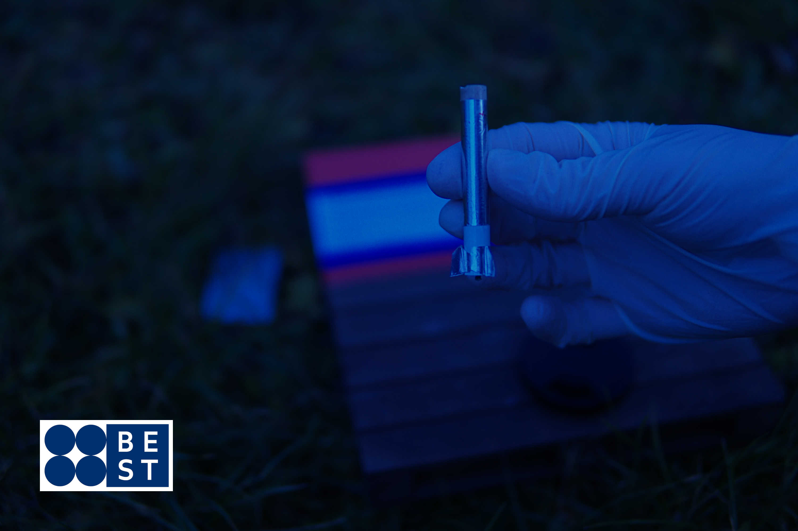

## First launch of the Bilberry rocket
<code>December 4th, 2021</code> 

Berry Empire Space & Telemetry launched the Bilberry rocket today.
This rocket is tiny, but reusable. Sadly, it couldn't lift off.

 Bilberry Rocket 

<iframe width="500" height="500" src="https://www.youtube.com/embed/yzNHw41zXjs" title="YouTube video player" frameborder="0" allow="accelerometer; autoplay; clipboard-write; encrypted-media; gyroscope; picture-in-picture"></iframe>

 Slow-motion recording of the launch 

